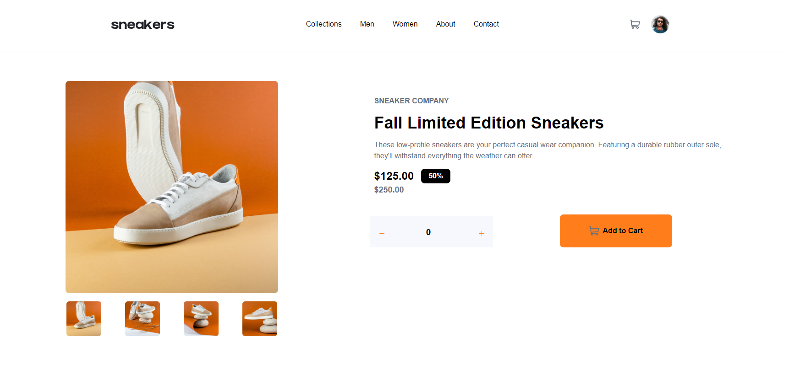
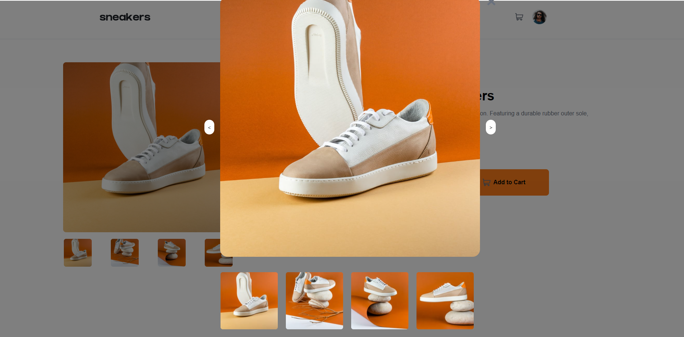
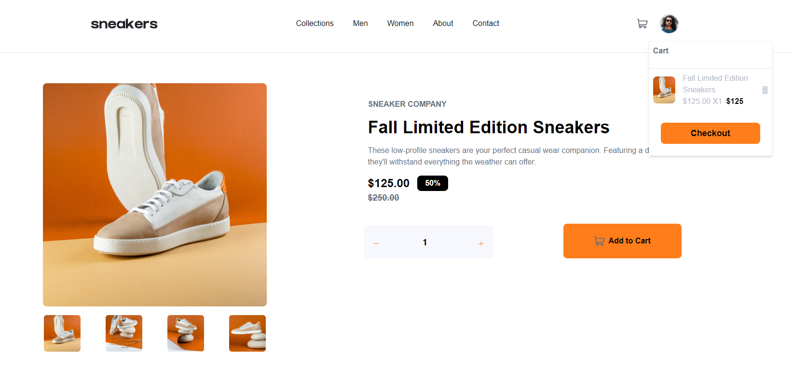
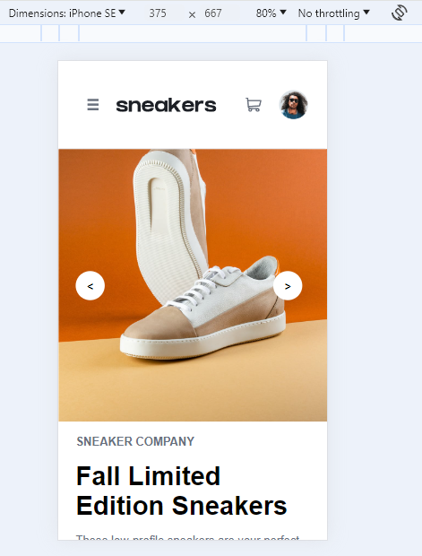
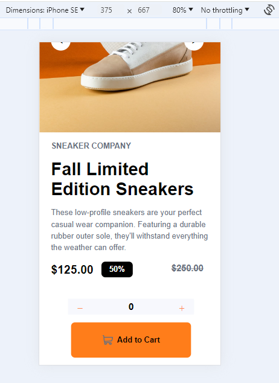
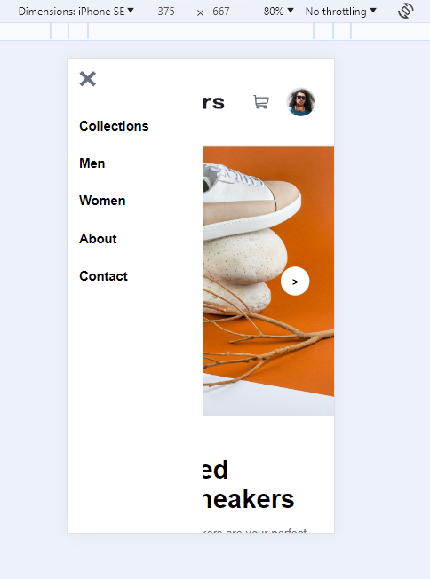

# Ecommerce Product Solution Page

This project was aimed at learning about ecommerce product landing pages, functionality and styling based on design.

This is a solution to the [E-commerce product page challenge on Frontend Mentor](https://www.frontendmentor.io/solutions/responsive-ecommerce-landing-page-tailwindcss-reactjs-vite-XknmCrVmjT). Frontend Mentor challenges help you improve your coding skills by building realistic projects.

## Table of contents

- [Overview](#overview)
  - [The challenge](#the-challenge)
  - [Screenshots](#screenshots)
  - [Links](#links)
- [My process](#my-process)
  - [Built with](#built-with)
  - [Continued development](#continued-development)
  - [Useful resources](#useful-resources)
- [Author](#author)

## Overview

This project was an exercise in creating an ecommerce product landing web page featuring a cart functionality that adapts to both desktop and mobile interfaces. The challenge was to implement hover states for all interactive elements, ensuring a seamless user experience across different devices. Key skills applied in this project included the use of flexbox for layout management, TailwindCSS for styling, and ReactJS for dynamic state management and useState. The project aimed to refine my understanding of responsive design, emphasizing desktop and mobile compatibility.

### The challenge

Users should be able to:

- View the optimal layout for the site depending on their device's screen size
- See hover states for all interactive elements on the page
- Open a carousel gallery by clicking on the large product image
- Switch the large product image by clicking on the small thumbnail images
- Add items to the cart
- To be continued: View the cart and remove items from it

### Screenshots

Desktop Landing Page:

Desktop Carousel Images:

Desktop Cart Functionality:

Mobile Landing Page:

Mobile Landing Page Side Navigation Bar:

### Links

- Solution URL: [Laura Dev Solution Frontend Mentor Ecommerce Page](https://www.frontendmentor.io/solutions/responsive-ecommerce-landing-page-tailwindcss-reactjs-vite-XknmCrVmjT)
- Live Site URL: [Laura Dev Ecommerce Landing Page Netlify](https://ecommercelandingpage-lauradev.netlify.app/)

## My process

This project began with the initial setup, which included creating a GitHub repository, initializing a Vite project with ReactJS, and integrating TailwindCSS. I configured TailwindCSS to incorporate the project's design specifications, such as fonts and colors. After ensuring the foundational elements were operational through an initial commit, I proceeded to remove the default ReactJS template content to start with a clean slate. I have honed my ability to create a setup quickly for projects to be able to spend time on other elements.

My approach to tackling the project was organized and logical. I started by reviewing the provided design layout and style guide while using my learnings from other projects. This preliminary planning phase helped me strategize the implementation of key features, including hover states, a mobile-responsive layout, and dropdown menu for the cart. The decision to prioritize the desktop layout and navigation set the stage for a structured development process. After creating of a design skeleton for desktop, I wanted to work on the functionality of the counter button, add to cart button and useState between all pieces of the website.

The construction of the desktop layout was the first piece, where I focused on replicating the design's key navigation elements: positioning the logo, adding hover states to text, adding the avatar and cart icons. Afterwards, I worked on creating the desktop text and images in the main section. This phase laid a solid foundation for the user experience.

I initiated development on the count button, add to cart button, and the cart component functionalities. This phase presented challenges as it involved deepening my understanding of useState functionality and props. My first task was to refine the count button, ensuring it accurately responded to both increment (+) and decrement (-) actions. Subsequently, I developed the Add to Cart button, incorporating a cart icon. Integrating these buttons within the application, especially in terms of passing the count data, was particularly challenging. Through this process, I explored various strategies for managing state, from global to local scopes.

Transitioning to the mobile layout, I aimed to maintain consistency with the desktop version while accommodating the nuances of a smaller viewport. Implementing the sidebar required a deeper dive into React's useState hooks for dynamic content display, alongside mastering TailwindCSS for styling. The development of an animated sidebar, triggered by the hamburger icon, involved careful consideration of text styling and the integration of dropdown functionality. This phase was instrumental in enhancing my understanding of state management and UI interactivity.

The final touches to the project involved refining hover states and ensuring compliance with the design requirements. The adjustment of media queries ensured a seamless transition between different device sizes. Deploying the project on Netlify was the culmination of my efforts, providing a live website of my work.

### Built with

- [React](https://reactjs.org/) - JS library
- TailwindCSS
- Vite
- Google Fonts
- Semantic HTML5 markup
- CSS custom properties
- Flexbox
- CSS Grid
- Mobile-first workflow

### Continued development

Things I would like to work after submission of this project:
- Styling of carousel arrow buttons in desktop version
- Orange hightlight for hover states on thumbnails
- Navigation bar highlights for hover state to be styled differently
- Avartar hover state to highlight the image orange
- Adding number of items in cart with small icon about cart image in navigation bar
- Trash icon functionality in cart

### Useful resources

Resources I used to help build my project or reference:

- [Google Fonts](https://fonts.google.com/specimen/Kumbh+Sans) 
- [ React Icons Installation](https://www.npmjs.com/package/react-icons)
- [React icons page](https://react-icons.github.io/react-icons/)
- [TailwindCSS Control Button](https://flowbite.com/docs/forms/number-input/)
- [Counter Button](https://tailwindcomponents.com/component/number-input-counter)

## Author

- Website - [Laura V](https://lauradeveloper.com/)
- Frontend Mentor - [@lavollmer](https://www.frontendmentor.io/profile/lavollmer)
- Github - [@lavollmer](https://github.com/lavollmer)

